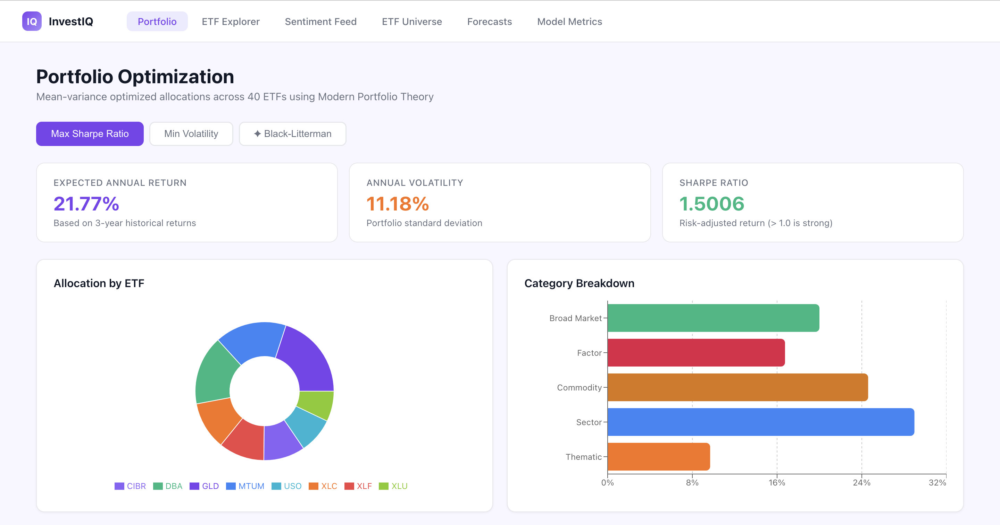
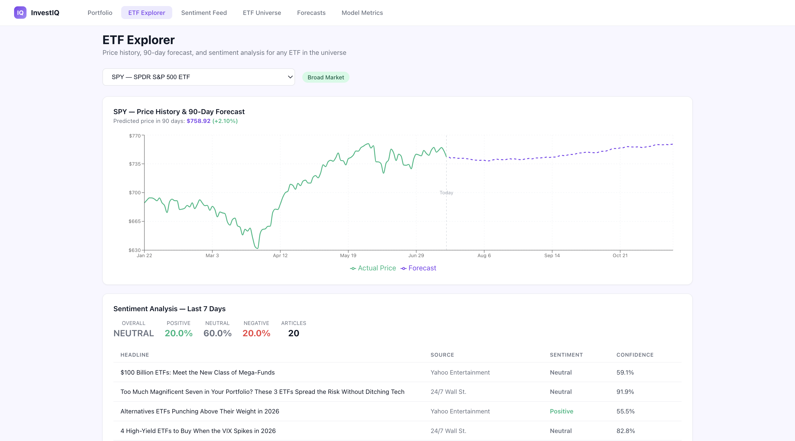
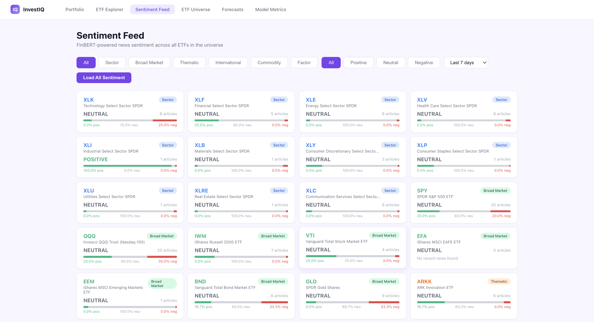
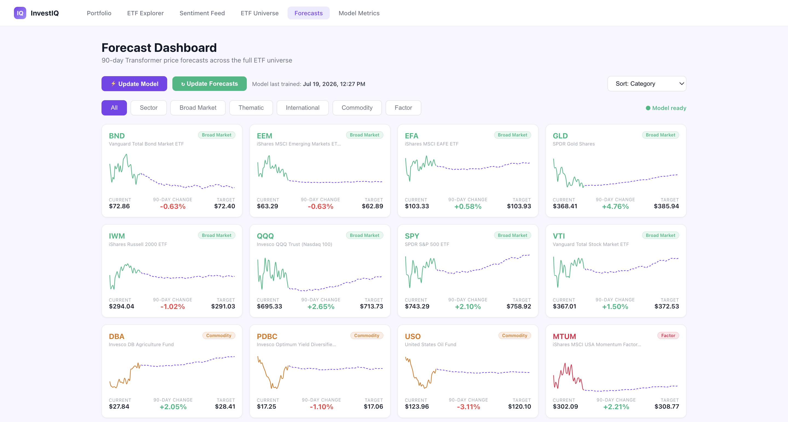
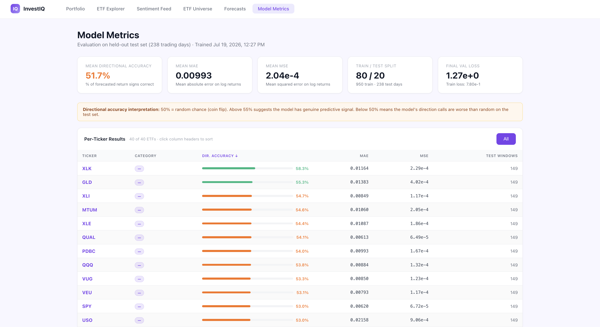

# InvestIQ

A full-stack investment intelligence platform: automated ETF data ingestion, mean-variance and Black-Litterman portfolio optimization, a Transformer-based 90-day price forecasting model, and FinBERT sentiment analysis on live news — all surfaced through a React dashboard backed by a FastAPI/Postgres-or-SQLite API.

[Source](https://github.com/avenjwilliams/investiq) — see [Running locally](#running-locally) below to try it yourself.

---

## What it does

InvestIQ tracks a 40-ETF universe spanning Sector, Broad Market, Thematic, International, Commodity, and Factor exposures, and gives each one:

- **Portfolio Optimization** — Max Sharpe, Min Volatility, and Black-Litterman allocations computed with [PyPortfolioOpt](https://pyportfolioopt.readthedocs.io/), with Black-Litterman blending market-implied equilibrium returns with the Transformer model's own forecasts as its "views."
- **90-day price forecasts** — a shared multivariate Transformer (see [Model Validation](#model-validation) below for how well it actually works) trained across all 40 tickers at once, with per-ticker embeddings.
- **News sentiment** — FinBERT-scored headlines per ETF, pulled from NewsAPI, classified positive/negative/neutral with confidence scores.
- **A reference layer** (ETF Universe page) explaining what each category means and why it's in the universe — built so the dashboard is legible to someone who isn't already a portfolio-construction expert.

### Feature tour

**Portfolio** — Allocation pie chart + category breakdown for all three optimization strategies, with expected return / volatility / Sharpe ratio.


**ETF Explorer** — Price history + 90-day forecast overlay and 7-day sentiment for any single ETF.


**Sentiment Feed** — FinBERT sentiment across the whole universe, filterable by category and sentiment.


**ETF Universe** — What each of the 6 categories is, why it's included, and the full holdings list. (Tall, expandable-accordion page — best explored live rather than in a single screenshot.)

**Forecasts** — Grid of all 40 ETFs' forecasts with sparklines, sortable by predicted return.


**Model Metrics** — Held-out test set results: directional accuracy, MAE, MSE, per-ticker breakdown.


---

## Model Validation

This is the part most portfolio projects skip, so it gets its own section.

**The question:** does a Transformer trained on lagged returns, volume, RSI-14, 10-day momentum, and macro features (VIX, 10-year yield) have genuine next-day directional signal on a diversified 40-ETF universe?

**The answer, after three independent checks: no**, and here's the honest trail that got there rather than a single flattering number.

1. **Baseline Transformer** (returns + VIX/TNX only), evaluated with 5-fold walk-forward (expanding-window) cross-validation: **50.16% ± 1.35pp** directional accuracy. 50% is coin-flip.
2. **Richer features** (+ volume, RSI-14, 10-day momentum) tightened consistency across folds (±1.35pp → ±0.83pp) but landed at **50.39% ± 0.83pp** — a +0.39pp improvement over 50% against a standard error of ~0.37pp (t ≈ 1.05, not statistically significant). Benchmarked against the published Fischer & Krauss (2018) LSTM result of 51.4% on a comparable task, for scale.
3. **Cross-sectional check**, to rule out the "edge" being market drift rather than real signal: a naive "always predict up" rule alone hit 53.52% on raw direction (more up days than down days in the sample window — not skill). Once the target was redefined as *relative* performance (did a ticker beat the equal-weighted universe average that day, removing drift), the floor collapsed to 50.40% as expected, and a logistic regression baseline scored **below** that floor (50.14–50.31%) on both raw and demeaned features.

**Conclusion:** three independent methods — a walk-forward-validated Transformer, a linear baseline, and a drift-controlled cross-sectional check — converge on the same result. There's no reliable directional edge in this feature set for daily-frequency prediction on liquid, diversified ETFs, which is roughly what market efficiency would predict. Reporting that honestly, with the numbers and the reasoning that got there, is the actual point of this section — a suspiciously good backtest is usually a bug, not a discovery.

The Model Metrics page in the app reports these same numbers per-ticker against a held-out test set, not just the CV summary above.

---

## Architecture

```
┌─────────────┐      ┌──────────────────┐      ┌─────────────────┐
│   React     │─────▶│   FastAPI         │─────▶│  Postgres /      │
│  frontend   │◀─────│   backend         │◀─────│  SQLite          │
└─────────────┘      └──────────────────┘      └─────────────────┘
                             │
                 ┌───────────┼───────────┐
                 ▼           ▼           ▼
            yfinance     NewsAPI    Transformer / FinBERT
           (price data) (headlines)   (TensorFlow / HF)
```

- **Backend** — FastAPI + SQLAlchemy, APScheduler for daily price fetches, all analytics (optimization, forecasting, sentiment) as pure Python modules called from thin route handlers.
- **Data** — SQLite by default; swaps to Postgres via a single `DATABASE_URL` env var with no code changes (`NullPool` so it also works cleanly against a host that recycles connections).
- **Forecasting** — a shared Transformer (not one model per ticker) with per-ticker embeddings, a dedicated binary direction-classification head trained alongside the regression head, and per-horizon (day+1 through day+90) accuracy logging.
- **Frontend** — React + Recharts, API base URL read from `REACT_APP_API_URL` (baked in at build time).

### Stack

| Layer | Tech |
|---|---|
| Backend | FastAPI, SQLAlchemy, SQLite (default) / Postgres (via `DATABASE_URL`) |
| Data | yfinance, NewsAPI |
| Analytics | PyPortfolioOpt, TensorFlow/Keras (Transformer), HuggingFace FinBERT |
| Scheduler | APScheduler — daily price fetch (Mon–Fri 6PM ET) |
| Frontend | React, Recharts, Axios |

---

## Running locally

```bash
# Backend
conda activate investment-platform   # or your own venv
cd investment-platform
python backend/main.py

# Frontend (separate terminal)
cd investment-platform/frontend
npm start
```

Copy `.env.example` → `.env` (backend) and `frontend/.env.example` → `frontend/.env.local`, and fill in `NEWS_API_KEY` if you want sentiment data (a free key is at [newsapi.org](https://newsapi.org)). `DATABASE_URL` can be left unset locally — it falls back to a local SQLite file.

To train the Transformer locally:
```bash
curl -X POST http://localhost:8000/forecast/transformer/train-all
```

---

## Deployment notes

The app is built to be deployment-ready — `render.yaml`, `.env.example` files, a configurable `DATABASE_URL`/`ALLOWED_ORIGINS`/`REACT_APP_API_URL`, and Postgres support via a single env var swap — and was fully deployed and tested end-to-end on Vercel + Render (free tier) + Neon during development.

It's presented here as a local project rather than a live link. The reason is specific, not general hosting aversion: this app runs two full ML frameworks in one process (TensorFlow for the Transformer, PyTorch/Transformers for FinBERT), and free-tier hosts capped at 512MB RAM can't reliably hold both — training and FinBERT sentiment both OOM-crashed the instance in practice (confirmed via the host's own memory logs). A paid tier or a memory-lighter sentiment model would fix this; neither was worth taking on for a project meant to demonstrate the modeling and engineering, not run a 24/7 service.

Everything needed to redeploy is still in the repo if you want to try it yourself.

---

## Project layout

```
backend/
  analytics/       portfolio optimization, Transformer forecasting, FinBERT sentiment
  data/            SQLAlchemy models + engine config
  ingestion/       yfinance price fetching
  routes/          FastAPI route handlers
  scheduler/       APScheduler jobs
  models/          committed Transformer weights + metrics
frontend/
  src/pages/       one file per dashboard page
  src/api/         Axios client
```
